<div align="center">



# ⚡ Awesome Supply Chain Finance (SCF) Platforms & Working Capital Ecosystem 🌐

<p align="center">
  <strong>A curated index of top-tier SaaS platforms, multi-funder networks, and open-source infrastructure for Supply Chain Finance, Reverse Factoring, Dynamic Discounting, and Trade Liquidity.</strong>
</p>

<p align="center">
<a href="https://github.com/ishandutta2007/Awesome-Awesome-Awesome"></a><a href="https://discord.gg/jc4xtF58Ve"></a>
<a href="https://github.com/ishandutta2007/Awesome-Supply-Chain-Finance-Platform/stargazers"></a>
<a href="https://github.com/ishandutta2007/Awesome-Supply-Chain-Finance-Platform/network/members"></a>
<a href="https://github.com/ishandutta2007/Awesome-Supply-Chain-Finance-Platform/issues"></a>
<a href="https://github.com/ishandutta2007/Awesome-Supply-Chain-Finance-Platform/blob/main/LICENSE"></a>
<a href="https://github.com/ishandutta2007"></a>
</p>

</div>

---

## 🧭 Table of Contents
- [📌 Executive Overview & SEO Keywords](#-executive-overview--seo-keywords)
- [🏢 SaaS & Hosted Enterprise SCF Platforms](#-saashosted-enterprise-scf-platforms)
- [💻 Open-Source Repositories & Fintech Engines](#-open-source-repositories--fintech-engines)
- [🏗️ Architectural Foundations for Custom SCF Programs](#️-architectural-foundations-for-custom-scf-programs)
- [📚 Key Terminology & Concepts](#-key-terminology--concepts)
- [🤝 How to Contribute](#-how-to-contribute)
- [📈 Star History](#-star-history)
- [⚖️ Disclaimer & Compliance Note](#️-disclaimer--compliance-note)

---

## 📌 Executive Overview & SEO Keywords

**Supply Chain Finance (SCF)** encompasses financial instruments and technology solutions designed to optimize working capital, lower supply chain disruption risks, and unlock cash trapped across buyer-supplier-funder ecosystems. 

### 🔍 Core Focus Pillars & Keywords
- **Reverse Factoring (Approved Payables Financing)**: Buyer-centric financing where suppliers receive early invoice settlement based on the buyer's investment-grade credit rating.
- **Dynamic Discounting**: Buyer self-funded early payment programs providing sliding-scale discount rates for accelerated invoice settlements.
- **Multi-Funder Syndication**: Automated bank and institutional capital syndication rails distributing trade credit liquidity.
- **Cross-Border Factoring & Export Finance**: Non-recourse receivables financing facilitating international B2B commerce.
- **Real-World Asset (RWA) & Blockchain Invoicing**: Tokenized receivables, cryptographic escrow, and smart contract settlement.
- **Working Capital AI & Predictive Cash Forecasting**: Decision intelligence models evaluating supplier health, liquidity needs, and payment terms.

---

## 🏢 SaaS/Hosted Enterprise SCF Platforms

The table below catalogs premier hosted SaaS platforms, working capital marketplaces, and multi-funder networks. Ranked in **descending order by company scale** (market cap / valuation / funding):

| 🚀 Platform | 📝 Description | 📊 Company Size (Valuation / Revenue) | 💳 Pricing (Starting Tier) | 🎁 Free Tier / Free Trial Limits |
| :--- | :--- | :--- | :--- | :--- |
| **[FIS Supply Chain Finance](https://www.fisglobal.com/)** | 🏦 Comprehensive enterprise treasury and bank-agnostic SCF platform for global trade and payables processing. | **Public (NYSE: FIS)**: ~$21B–$22B Market Cap / ~$10.1B Annual Revenue | Enterprise treasury package starting at ~$50,000/year base license (tiered by corporate revenue and connected banking rails) + bank syndication fees. | **Free forever for suppliers**: Unlimited portal access to view purchase orders, submit invoices, and track payment schedules; 0-day buyer trial (guided sandbox demo upon engagement). |
| **[Taulia (SAP)](https://taulia.com/)** | 🏢 Working-capital and SCF platform offering dynamic discounting, reverse factoring, and deep ERP integration. | **SAP Subsidiary** (SAP Market Cap ~$250B+): ~$91M+ Est. Revenue / $1T+ Annual Processed Volume | Enterprise buyer annual subscription starting at ~$30,000/year + dynamic early payment discount rate (~1.0%–2.0% APR per accelerated invoice). | **Free forever for suppliers**: Unlimited electronic invoice submission, purchase order acknowledgment, and payment tracking; 0-day buyer trial (guided enterprise demo upon request). |
| **[Tradeshift](https://tradeshift.com/)** | 🌍 Global B2B e-invoicing and supply chain commerce network with embedded dynamic early payments. | **~$2.7B Valuation** / ~$161.5M Est. Revenue / $1.1B+ Total Capital Raised | Transaction tiers: $0.80/transaction (31–300 invoices/quarter), $0.60/transaction (301–3,000 invoices/quarter), $0.30/transaction (3,001–15,000 invoices/quarter); buyer network from ~$2,000/month. | **Free forever plan for up to 30 invoices/quarter** (includes basic digital invoicing, order confirmation, and payment status tracking). |
| **[C2FO](https://c2fo.com/)** | 💡 Dynamic discounting & working-capital marketplace where suppliers set custom rates for early payment on approved invoices. | **~$1.7B–$2.7B Valuation** / ~$107M–$186M Est. Revenue / $500B+ Total Funded Volume | Free portal access for suppliers + supplier-offered early payment discount (typically 0.5%–2.0% per 30-day acceleration or ~6%–18% annualized APR); buyers pay ~5%–10% shared-savings fee. | **Free forever plan for suppliers**: Unlimited invoice browsing, offer bidding, and cash flow forecasting with 0 setup or transaction fees; 0-day buyer trial (custom pilot program on agreement). |
| **[GTreasury](https://www.gtreasury.com/)** | 📊 Cloud-native treasury management system (TMS) with working capital and supply chain finance capabilities. | **~$1.0B Valuation** (Acquired by Ripple) / ~$25.7M Est. Revenue | Modular TMS SaaS subscription starting at ~$2,500/month (~$30,000/year for core cash, bank connectivity, and SCF modules). | **0-day free trial** (no public freemium); guided proof-of-concept (POC) sandbox and custom demo available upon sales qualification. |
| **[Demica](https://www.demica.com/)** | 🏗️ Structured SCF, receivables, and payables financing platform for large corporates and financial institutions. | **~$300M Acquisition** (by FIS) / ~$33.4M Est. Revenue / $25B+ Funded Programs | Enterprise platform fee starting from ~$35,000/year + 0.15%–0.50% AUM administration fee on funded receivables facilities. | **Free forever for enrolled suppliers**: Unlimited invoice viewing and status tracking; 0-day anchor trial (custom sandbox/demo environment available during procurement). |
| **[Orbian](https://www.orbian.com/)** | 🌐 Universal multi-currency reverse-factoring and supply chain finance program provider. | **>$300M Annual Revenue** / Multi-billion Dollar Global Settlement Volume | 0 setup/monthly fees for suppliers; discount rate of benchmark rate (SOFR) + 0.8%–1.8% per annum margin; corporate buyer program fee starting at ~$20,000/year. | **Free forever for suppliers**: Unlimited invoice viewing, settlement notifications, and portal access with 0 account/maintenance fees; 0-day buyer trial (pilot demonstration on request). |
| **[CredAble](https://www.credable.in/)** | 🇮🇳 Working capital and SCF platform specializing in enterprise vendor financing, MSME early payments, and receivable discounting. | **~$177M Valuation** / $124M+ Total Funding Raised | 0 upfront/registration fee; processing fee up to 2% p.a. + financing interest rates starting at ~0.75%–1.5% per month (~9%–18% p.a.) on utilized credit limit. | **Free forever for vendors**: Unlimited vendor registration, purchase order tracking, and invoice status viewing with 0 account fees; 0-day buyer trial (guided corporate demo on request). |
| **[MODIFI](https://www.modifi.com/)** | 🚢 Global business payments and trade finance platform providing digital export invoice factoring. | **~$120M+ Valuation** (Series B) / $329M+ Total Debt & Equity Raised | Starting at 0.99% per 30 days (advances up to 80%–90% of invoice value, terms 30–120 days) + fixed disbursement fee (~$15–$30 per payout). | **Free forever digital account**: Free registration, buyer credit risk checks, and invoice upload with 0 monthly subscription fees; 0-day trial for financed transactions. |
| **[Drip Capital](https://www.dripcapital.com/)** | ⚡ Cross-border trade finance & export invoice factoring platform for international supply chains. | **~$100M+ Valuation** / $428M Total Capital & Debt Facilities Raised | Financing rates starting at 0.8%–1.4% per month (~9.6%–16.8% APR) + 0.54% monthly factoring commission + 0.3%–1% one-time facility setup fee (advances up to 90% of invoice value). | **Free forever trade evaluation**: Free registration and automated buyer/supplier credit limit assessment with 0 upfront software fees; 0-day trial for disbursed funds. |
| **[Treasury Intelligence Solutions (TIS)](https://www.tis.biz/)** | 🔒 Enterprise cloud platform for corporate payments, bank connectivity, cash visibility, and working capital optimization. | **~$48.2M Est. Revenue** / $100M+ Funding (Marlin Equity Backed) | SaaS subscription starting at ~$1,500/month (~$18,000/year base tier for multi-bank connectivity & cash management) + volume-based tiering. | **0-day free trial** (no self-service freemium); interactive guided product demo and custom proof-of-concept (POC) sandbox provided upon qualification. |
| **[PrimeRevenue](https://www.primerevenue.com/)** | 🚀 Global multi-funder supply chain finance platform connecting buyers, suppliers, and funding partners for early payment. | **~$55M Est. Valuation** / ~$25M Est. Revenue / $300B+ Annual Volume | Enterprise buyer license from ~$25,000/year base platform fee + supplier discount margin (SOFR/EURIBOR + 1.0%–2.5% margin per invoice advanced). | **Free forever for suppliers**: Unlimited invoice status tracking, PO visibility, and remittance advice with 0 portal fees; 0-day buyer trial (custom demo/working capital analysis upon request). |
| **[Incomlend](https://www.incomlend.com/)** | 🤝 Non-recourse invoice financing marketplace connecting global suppliers with institutional investors. | **~$22M Total Funding Raised** / ~$2.4M–$10M Est. Revenue | Discount rates starting at 0.5%–1.2% per month (~6%–14.4% annualized on non-recourse advances up to 90% invoice value) + administrative fee (~0.2%–0.5% per trade). | **Free forever onboarding**: Free company verification, digital invoice upload, and credit assessment (0 monthly platform maintenance fee); 0-day trial for funded facilities. |
| **[Finverity](https://www.finverity.com/)** | 💻 Digital trade and supply chain finance ecosystem technology (FinverityOS) and capital syndication platform. | **~$8M Total Funding Raised** (Series A) | FinverityOS SaaS license starting at ~$2,000/month (~$24,000/year) for trade asset management + transaction structuring fee (0.25%–0.75% of volume). | **0-day free trial** (no public freemium); 14-day assisted pilot and structured sandbox environment available upon institutional qualification. |
| **[Stemly](https://www.stemly.ai/)** | 🤖 AI-powered decision intelligence SaaS for cash flow forecasting, working capital, and supply chain optimization. | **~$4.8M Total Funding Raised** (Seed stage) | Enterprise AI SaaS subscription starting at ~$3,500/month (~$42,000/year base tier for cash flow and working capital optimization). | **0-day free trial** (no public free plan); 30-day customized proof-of-value (PoV) / pilot using historical corporate ERP data upon qualification. |

---

## 💻 Open-Source Repositories & Fintech Engines

Open-source building blocks, ERP backbones, smart contract engines, and distributed ledger platforms designed to build custom supply chain finance workflows. Sorted in **descending order by GitHub star count**:

1. ### 📦 [odoo/odoo](https://github.com/odoo/odoo) [](https://github.com/odoo/odoo/stargazers)
   - **Focus**: Enterprise Resource Planning (ERP), Open Invoicing, Receivables Management & Factoring Add-ons.
   - **Description**: Comprehensive open-source business management suite featuring full double-entry accounting, automated invoice approval pipelines, credit management, and extensible factoring / bank payment gateways.
   - **Tech Stack**: Python, JavaScript, PostgreSQL.

2. ### ⚙️ [frappe/erpnext](https://github.com/frappe/erpnext) [](https://github.com/frappe/erpnext/stargazers)
   - **Focus**: Modular Business Suite, Accounts Receivable/Payable, Dynamic Invoice Discounting & Payment Requests.
   - **Description**: Free and open-source full ERP platform equipped with native payment reconciliation, purchase order matching, supplier portal features, and programmable discounting triggers.
   - **Tech Stack**: Python, MariaDB, JavaScript (Frappe Framework).

3. ### ⛓️ [hyperledger/fabric](https://github.com/hyperledger/fabric) [](https://github.com/hyperledger/fabric/stargazers)
   - **Focus**: Permissioned Distributed Ledger, Multi-Party Consortia & Enterprise SCF Networks.
   - **Description**: Highly scalable enterprise DLT platform widely deployed by global banking consortia and logistics giants for confidential multi-funder invoice verification, fraud prevention, and automated multi-tier financing.
   - **Tech Stack**: Go, Docker, gRPC.

4. ### 🧾 [invoiceninja/invoiceninja](https://github.com/invoiceninja/invoiceninja) [](https://github.com/invoiceninja/invoiceninja/stargazers)
   - **Focus**: Invoicing Engine, Client Portal, Payment Gateways & Early Payment Notifications.
   - **Description**: Leading self-hosted invoicing and billing platform for businesses, providing clean APIs for invoice generation, payment gateway orchestration, and early-settlement tracking.
   - **Tech Stack**: PHP (Laravel), Flutter, MySQL.

5. ### 📄 [crater-invoice/crater](https://github.com/crater-invoice/crater) [](https://github.com/crater-invoice/crater/stargazers)
   - **Focus**: Open-Source Invoicing Application & SME Receivables Tracking.
   - **Description**: Modern, open-source invoice management application providing payment reminders, estimation conversion, and multi-currency billing rails suitable for micro-factoring frontends.
   - **Tech Stack**: PHP (Laravel), Vue.js, MySQL.

6. ### 🏛️ [corda/corda](https://github.com/corda/corda) [](https://github.com/corda/corda/stargazers)
   - **Focus**: Institutional DLT for Regulated Financial Institutions & Trade Finance Ecosystems.
   - **Description**: Private, peer-to-peer distributed ledger purpose-built for financial services. Powers prominent global trade finance consortia for digital letters of credit (LCs), electronic bills of lading, and multi-funder SCF.
   - **Tech Stack**: Kotlin, Java, Gradle.

7. ### 💳 [killbill/killbill](https://github.com/killbill/killbill) [](https://github.com/killbill/killbill/stargazers)
   - **Focus**: Subscription Billing, Payment Orchestration & Multi-Tenant Invoicing Engine.
   - **Description**: Industrial-strength open billing and payment processing platform with a plugin architecture capable of managing complex cash flows, payment routing, and settlement ledger reconciliation.
   - **Tech Stack**: Java, OSGi, MySQL/PostgreSQL.

8. ### 📝 [digital-asset/daml](https://github.com/digital-asset/daml) [](https://github.com/digital-asset/daml/stargazers)
   - **Focus**: Smart Contract Language for Multi-Party Financial Workflows & Trade Finance.
   - **Description**: Multi-party application framework that accurately models rights, obligations, and atomic settlements across buyers, suppliers, credit insurers, and funding banks.
   - **Tech Stack**: Haskell, Scala, TypeScript.

9. ### 🏦 [apache/fineract](https://github.com/apache/fineract) [](https://github.com/apache/fineract/stargazers)
   - **Focus**: Core Banking Infrastructure, Lending & Receivables Credit Administration.
   - **Description**: Apache-governed core banking platform offering comprehensive loan origination, installment servicing, interest accrual calculations, and portfolio credit management for microfinance and trade credit facilities.
   - **Tech Stack**: Java, Spring Boot, MySQL.

10. ### 🪙 [centrifuge/centrifuge-chain](https://github.com/centrifuge/centrifuge-chain) [](https://github.com/centrifuge/centrifuge-chain/stargazers)
    - **Focus**: Real-World Asset (RWA) Tokenization & On-Chain Invoice Financing.
    - **Description**: Dedicated blockchain protocol connecting real-world assets (invoices, trade receivables, freight bills) with decentralized liquidity pools through fractional tokenized pools (Tinlake).
    - **Tech Stack**: Rust, Substrate, Polkadot.

11. ### 🚀 [bhojpur/scf](https://github.com/bhojpur/scf) [](https://github.com/bhojpur/scf/stargazers)
    - **Focus**: Decentralized Supply Chain Finance Engine & Microservices Infrastructure.
    - **Description**: Experimental open-source supply chain finance platform engine built on cloud-native microservices architecture and smart contracts for multi-enterprise working capital execution.
    - **Tech Stack**: Go, Protocol Buffers, gRPC.

12. ### 🌐 [XinFinOrg/TradeFinexLive](https://github.com/XinFinOrg/TradeFinexLive) [](https://github.com/XinFinOrg/TradeFinexLive/stargazers)
    - **Focus**: Open Trade Finance Protocol & Digital Factoring Instruments.
    - **Description**: Open protocol exploring digital bonds, electronic bills of lading, and interoperable trade finance instruments over the XDC Network.
    - **Tech Stack**: Solidity, JavaScript, Web3.

---

## 🏗️ Architectural Foundations for Custom SCF Programs

Building a production-grade custom SCF or Dynamic Discounting solution typically combines three critical technology tiers:

```
  ┌─────────────────────────────────────────────────────────────┐
  │                 1. ERP / Invoicing Backbone                 │
  │     (Odoo, ERPNext, Invoice Ninja, Custom SAP Connector)    │
  │      • PO Matching  • Invoice Approval  • 3-Way Match       │
  └──────────────────────────────┬──────────────────────────────┘
                                 │
  ┌──────────────────────────────▼──────────────────────────────┐
  │             2. Financing Engine & Workflow Logic             │
  │           (DAML, Fineract, Kill Bill, Custom Rails)         │
  │      • Discount Calculation  • Multi-Party Approvals        │
  │      • Credit Risk Assessment  • Tenor & Maturity Timers    │
  └──────────────────────────────┬──────────────────────────────┘
                                 │
  ┌──────────────────────────────▼──────────────────────────────┐
  │             3. Settlement & Liquidity Integration           │
  │        (Bank APIs, ISO 20022, DLT / Hyperledger / RWA)      │
  │      • Multi-Bank Payment Rails  • Funder Syndication       │
  │      • Automated Reconciliation  • Escrow Verification      │
  └─────────────────────────────────────────────────────────────┘
```

---

## 📚 Key Terminology & Concepts

- **Approved Payables Financing (Reverse Factoring)**: An arrangement where a corporate buyer approves supplier invoices, allowing the supplier to sell the receivable to a financial institution at favorable interest rates backed by the buyer's credit rating.
- **Dynamic Discounting**: An early payment option where the discount rate changes dynamically depending on how early the invoice is settled by the buyer using their own excess cash reserves.
- **Deep-Tier Supply Chain Finance**: Extending financing down to Tier-2, Tier-3, and lower-level suppliers using tokenized verifiable credentials or electronic promissory notes linked to the anchor buyer's purchase order.
- **Days Sales Outstanding (DSO) & Days Payable Outstanding (DPO)**: Key liquidity metrics that SCF platforms optimize simultaneously—lowering DSO for suppliers while expanding DPO for buyers.

---

## 🤝 How to Contribute

Contributions, updates, and feature additions are warmly welcomed!

1. 🍴 **Fork the repository** to your personal GitHub account.
2. 🌿 **Create a new branch**: `git checkout -b feature/add-new-scf-platform`.
3. ✨ **Add your entry**: Follow the existing format (Platform name, verified link, concise 1–2 sentence description, pricing/scale info, and star badge if open-source).
4. 📬 **Submit a Pull Request** with a brief summary of the addition.

---

## 📈 Star History

[](https://star-history.dera.page/#ishandutta2007/Awesome-Supply-Chain-Finance-Platform&type=date&legend=top-left)

---

## ⚖️ Disclaimer & Compliance Note

- ℹ️ This repository is a **community-curated index** created for research, technical architecture exploration, and education. It does not constitute financial, investment, or legal advice.
- 🏛️ Supply chain finance operations frequently involve banking regulations, KYC/AML compliance, credit risk underwriting, and legal assignment of receivables. Always ensure appropriate regulatory compliance before deploying financial workflows.

---

<div align="center">
  <sub>Maintained with ❤️ for Fintech Developers, Corporate Treasurers &amp; Working Capital Innovators.</sub>
</div>
